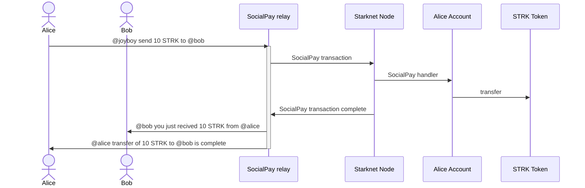

# Social pay repository with Relayer and tests

The Social pay provide Nostr user to send token easily via Starknet.

### Alice sends tokens to Bob




## How install and use it: 

If you made a changes on the Onchain contract, please build and add it into this repo. We can add a script later to do it.

### Locally
Install the packages
```bash 
    npm i
```

Run the Social relay in WIP
```bash 
    npm run relay:dev # with nodemon
    npm run relay
```

Run a Starknet dev:
[Localdevnet](https://github.com/0xSpaceShard/starknet-devnet-rs?tab=readme-ov-file) 


```bash 
    cargo run 
```

### Docker 

Work in progress

## Test the integration

Tests are script in Typescript. We are gonna use Chalk or Mochai after if needed.

Run the Social relay in WIP
```bash 
    npm run relay:dev # with nodemon
    npm run relay
```

### Tests the scripts

Run the integration test end to end
```bash 
    npm run test
```
